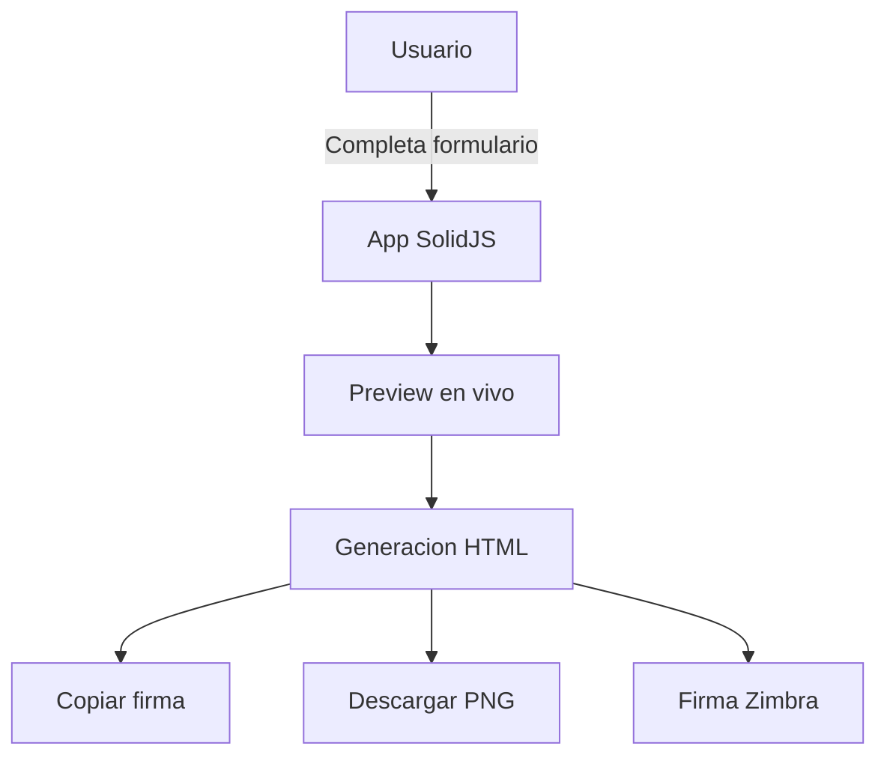

# g360-signature-creator

> Generador de firmas corporativas CIPSA con interfaz moderna. Genera firmas en 4 formatos: Completa, Media, Corta y Mínima (optimizada para Zimbra/Carbonio).

[](https://www.solidjs.com)
[](https://www.typescriptlang.org)
[](https://vitejs.dev)
[](https://opensource.org/licenses/MIT)



---

## Tabla de Contenidos

- [Descripción](#descripción)
- [Características](#características)
- [Tipos de Firma](#tipos-de-firma)
- [Tecnologías](#tecnologías)
- [Instalación](#instalación)
- [Desarrollo](#desarrollo)
- [Build](#build)
- [Zimbra / Carbonio](#zimbra--carbonio)
- [Estructura del Proyecto](#estructura-del-proyecto)
- [Familia G360](#familia-g360)

---

## Descripción

Generador web de firmas corporativas para CIPSA. Permite crear firmas de correo electrónico en 4 formatos diferentes según la necesidad del usuario. Diseñado para funcionar en Zimbra/Carbonio mediante el modo "Firma Mínima".

**Tipo**: Aplicación Web (SPA)
**Framework**: SolidJS + TypeScript + Vite
**Compatibilidad**: Todos los navegadores modernos

---

## Características

- **Tema Claro / Oscuro**: Toggle persistente en `localStorage`, detecta preferencia del sistema
- **5 Redes Sociales**: Facebook, Instagram, YouTube, TikTok, LinkedIn con toggles de visibilidad
- **6 Paletas de Colores**: Original (multicolor), Mono, Azul, Rojo, Verde, Outline
- **Mensaje Eco**: Banner "Antes de imprimir, piensa en el medio ambiente" con bandera de Perú
- **Logos SVG**: Logos vectoriales pre-cargados (logo1, logo2), conversión SVG → PNG bajo demanda
- **Logo Personalizado**: Subir imagen propia con preview en vivo
- **Modal de Confirmación**: Para acciones destructivas (reiniciar formulario)
- **Preview en Vivo**: Generación automática con debounce de 400ms
- **Validación de Campos**: Nombre y cargo obligatorios, validación de URLs y emails
- **Firma Digital**: Enlace discreto detrás del logo para identidad digital
- **Persistencia**: Borrador auto-guardado en `localStorage`
- **Accesibilidad**: `role`, `aria-*`, focus trap, tooltips con soporte de teclado

---

## Tipos de Firma

| Tipo | Logo | Contacto | Redes | Banner | Eco Badge |
|------|------|----------|-------|--------|-----------|
| **Completa** | ✅ | ✅ | ✅ | ✅ | ✅ |
| **Media** | ✅ | ✅ | ❌ | ❌ | ✅ |
| **Corta** | ❌ | ✅ | ❌ | ❌ | ✅ |
| **Mínima (Zimbra)** | ❌ | ✅ | ❌ | ❌ | ✅ |

### Detalles

- **Firma Completa**: Logo, datos de contacto, redes sociales, banner institucional y eco badge
- **Firma Media**: Logo y datos de contacto, sin banner ni eco badge
- **Firma Corta**: Solo datos esenciales para respuestas rápidas
- **Firma Mínima**: Sin logo ni redes sociales, solo contacto y eco badge. Optimizada para Zimbra/Carbonio

---

## Tecnologías

- **SolidJS 1.7** - Framework reactivo (reemplaza React con mejor rendimiento)
- **TypeScript 5** - Tipado estático estricto
- **Vite 4.5** - Build tool y dev server con HMR
- **CSS Puro** - Estilos con variables CSS para temas claro/oscuro

---

## Instalación

```bash
npm install
```

---

## Desarrollo

```bash
npm run dev
```

Luego abrir http://localhost:3000

> **Nota**: Si estás en WSL y observas errores de esbuild (`Unexpected token`), ejecuta `npm install` desde la terminal de Windows con Node 22.

---

## Build

```bash
npm run build
```

Genera los archivos estáticos en la carpeta `dist/`.

---

## Zimbra / Carbonio

### Flujo Recomendado

```
1. Completar formulario → Seleccionar "Firma Mínima"
2. Copiar HTML (botón "Copiar Firma (HTML)")
3. En Zimbra/Carbonio → Configurar firma → Editor HTML → Pegar
```

### ¿Por qué Firma Mínima?

- **Sin logo**: Zimbra/Carbonio puede tener conflictos con imágenes embebidas en tablas
- **Sin redes sociales**: Los iconos SVG embebidos pueden no renderizar correctamente en el editor HTML del webmail
- **Solo contacto + eco badge**: La información esencial sin elementos que puedan causar problemas de compatibilidad

### Características Técnicas para Webmail

- Tabla con `width="auto"` y `max-width="320px"` para mejor adaptación en el editor
- Iconos SVG como data URI (no PNG canvas) para mayor compatibilidad
- Sin JavaScript — HTML estático puro
- Compatible con: Zimbra 8.x, Zimbra 9.x, Carbonio, Outlook Web, Gmail

---

## Estructura del Proyecto

```
g360-signature-creator/
├── index.html
├── package.json
├── vite.config.js
├── tsconfig.json
├── manifest.json
├── .github/
│   └── workflows/
│       └── deploy.yml              # Deploy automático a GitHub Pages
├── public/
│   └── images/
│       ├── logo1.svg               # Logo CIPSA (relleno)
│       ├── logo2.svg               # Logo CIPSA (contorno)
│       ├── facebook.svg            # Iconos sociales
│       ├── instagram.svg
│       ├── youtube.svg
│       ├── tiktok.svg
│       ├── linkedin.svg
│       ├── whatsapp.svg
│       ├── telegram.svg
│       ├── ubicacion.svg
│       ├── phone_icon.svg
│       ├── mobile_icon.svg
│       ├── email_icon.svg
│       ├── eco.png                 # Badge eco-friendly
│       └── baner_lineas.png        # Banner institucional
├── samples/                         # Versión legacy (vanilla JS)
│   └── README.md
└── src/
    ├── index.jsx                    # Punto de entrada
    ├── index.css                    # Estilos globales (temas claro/oscuro)
    ├── types/
    │   └── index.ts                 # Tipos TypeScript
    ├── hooks/
    │   └── useLocalStorage.ts       # Persistencia en localStorage
    ├── utils/
    │   ├── signatureGenerator.ts    # Generación de HTML de firma
    │   ├── clipboard.ts             # Copiado al portapapeles (HTML)
    │   └── validation.ts            # Validación de campos y URLs
    └── components/
        ├── App.tsx                  # Componente raíz y estado global
        ├── PersonalDataSection.tsx  # Sección: nombre, cargo, email, teléfono
        ├── ContactSection.tsx       # Sección: extensión, móviles, dirección
        ├── VisualCustomizationSection.tsx  # Sección: logo, colores, línea
        ├── BannerSection.tsx        # Sección: banner institucional
        ├── SocialSection.tsx        # Sección: redes sociales + paleta
        ├── AdvancedConfigSection.tsx # Sección: firma digital
        ├── PreviewPanel.tsx         # Panel de vista previa
        ├── ActionButtons.tsx        # Botones de generación y acciones
        └── Modal.tsx                # Modal de notificación y confirmación
```

---

## Familia G360

Este proyecto forma parte de la familia de microherramientas **G360** para apoyo CRM y gestión de datos en escritorio, enfocadas en áreas como ventas, finanzas y logística.

### Herramientas Relacionadas

- **[g360-cli](https://github.com/carloscus/g360-cli)**: CLI para bootstrap de proyectos G360
- **[g360-signature](https://github.com/carloscus/g360-signature)**: Web component de branding G360
- **[g360-order-form](https://github.com/carloscus/g360-order-form)**: Sistema de gestión de hojas de pedido
- **[g360-order-xlsx](https://github.com/carloscus/g360-order-xlsx)**: Generador de cotizaciones Excel
- **[g360-day-calculator](https://github.com/carloscus/g360-day-calculator)**: Calculadora de días laborables

---

## Licencia

MIT License - ver [LICENSE](LICENSE) para más detalles.

---

**Marca**: G360
**Isotipo**: 3 puntos verticales paralelos (gris-verde-gris) + chevron `>`
**Autor**: Carlos Cusi
**Desarrollo**: Con asistencia de herramientas de código IA (Vibe Code)
**Powered by**: [g360-signature](https://github.com/carloscus/g360-signature)